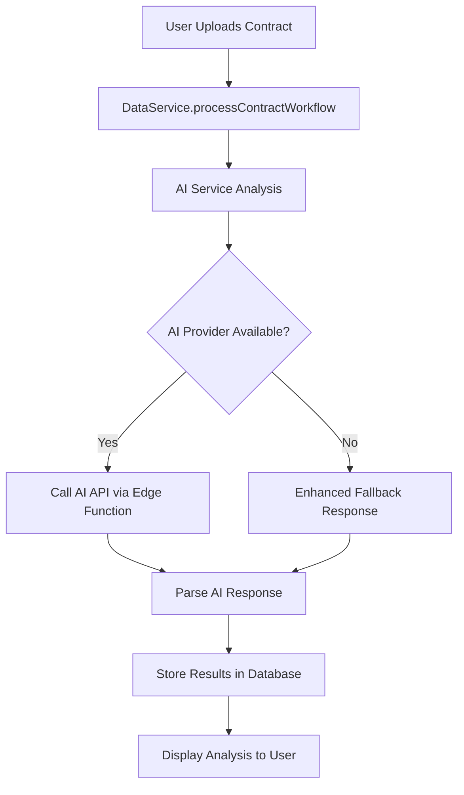

# 🤖 AI Implementation Complete - Setup Guide

## ✅ **What Has Been Implemented**

### **1. Real AI Integration**
- **Multiple AI Models**: OpenAI GPT-4, GPT-3.5, Anthropic Claude 3, Google Gemini Pro
- **Secure Processing**: Server-side AI calls via Supabase Edge Functions
- **Smart Fallbacks**: Enhanced mock responses when AI is unavailable
- **Performance Monitoring**: Detailed logging and error handling

### **2. Custom Solution Builder**
- **Admin Interface**: Full-featured custom solution creation modal
- **Database Persistence**: Custom solutions stored in Supabase
- **Advanced Configuration**: Custom prompts, compliance frameworks, AI model selection
- **Public Solutions**: Pre-built solutions available to all users

### **3. Enhanced Analysis Types**
- **Risk Assessment**: Financial, legal, operational, and compliance risk analysis
- **Compliance Scoring**: GDPR, data protection, industry standards evaluation
- **Perspective Review**: Multi-stakeholder analysis (buyer, seller, legal, individual)
- **Full Summary**: Comprehensive contract analysis with key terms and recommendations

### **4. Production-Ready Features**
- **Error Handling**: Graceful degradation and user-friendly error messages
- **Logging**: Comprehensive tracking of AI operations and performance
- **Security**: API keys handled server-side, secure data transmission
- **Scalability**: Efficient database design with proper indexing and RLS

## 🚀 **Setup Instructions**

### **Step 1: Deploy Database Schema**
```bash
# Apply the custom solutions migration
# See SQL_DEPLOYMENT_INSTRUCTIONS.md for detailed steps
```

### **Step 2: Deploy AI Edge Function**
```bash
# Deploy the contract analysis function
supabase functions deploy analyze-contract --project-ref cqvufndxjakdbmbjhwlx
```

### **Step 3: Configure AI API Keys**
```bash
# Set your AI provider API keys in Supabase secrets
supabase secrets set OPENAI_API_KEY=your_openai_key --project-ref cqvufndxjakdbmbjhwlx
supabase secrets set ANTHROPIC_API_KEY=your_anthropic_key --project-ref cqvufndxjakdbmbjhwlx
supabase secrets set GOOGLE_AI_API_KEY=your_google_key --project-ref cqvufndxjakdbmbjhwlx
```

### **Step 4: Test the Integration**
1. Upload a contract through the app
2. Select an analysis type
3. Verify AI analysis results
4. Create a custom solution via admin dashboard

## 📊 **AI Analysis Flow**



## 🔧 **Key Components**

### **Client-Side Services**
- **`client/services/aiService.ts`**: Main AI orchestration and custom solution management
- **`client/services/dataService.ts`**: Updated to use real AI instead of simulation
- **`client/components/modals/CustomSolutionModal.tsx`**: Enhanced admin interface for solution creation

### **Server-Side Processing**
- **`supabase/functions/analyze-contract/index.ts`**: Secure AI API integration
- **`supabase/migrations/20250107_create_custom_solutions.sql`**: Database schema for custom solutions

### **Database Schema**
- **`custom_solutions`**: Stores custom AI analysis configurations
- **Enhanced `contracts` and `contract_reviews`**: Links to custom solutions and AI metadata

## 🎯 **Supported Analysis Types**

### **Risk Assessment**
- **Financial Risks**: Payment terms, penalties, cash flow impact
- **Legal Risks**: Liability exposure, indemnification, compliance gaps
- **Operational Risks**: SLA feasibility, performance requirements
- **Compliance Risks**: Regulatory violations, policy gaps

### **Compliance Scoring**
- **GDPR Compliance**: Data protection, subject rights, processing lawfulness
- **Industry Standards**: Sector-specific regulations and best practices
- **Financial Regulations**: Banking, securities, and financial compliance
- **Employment Law**: Labor standards, worker protections

### **Perspective Review**
- **Buyer Perspective**: Advantages, concerns, negotiation points
- **Seller Perspective**: Revenue protection, risk mitigation
- **Legal Perspective**: Compliance, enforceability, risk assessment
- **Individual Perspective**: Privacy rights, data protection

### **Full Summary**
- **Executive Summary**: High-level overview and recommendations
- **Key Terms**: Critical clauses and important provisions
- **Action Items**: Specific steps for contract improvement
- **Risk Analysis**: Comprehensive risk identification and mitigation

## 🔐 **Security Features**

### **API Key Management**
- All AI API keys stored securely in Supabase secrets
- Never exposed to client-side code
- Encrypted in transit and at rest

### **Data Protection**
- Contract content processed server-side only
- Results stored with proper access controls
- RLS policies ensure data isolation

### **Error Handling**
- Graceful degradation when AI services unavailable
- User-friendly error messages
- Comprehensive logging for debugging

## 📈 **Performance & Monitoring**

### **Built-in Monitoring**
- AI response times and success rates
- Custom solution usage analytics
- Error tracking and alerting
- Performance metrics collection

### **Scalability Features**
- Efficient database indexing
- Connection pooling for high concurrency
- Caching strategies for frequently used solutions
- Asynchronous processing for large documents

## 🎨 **Custom Solution Features**

### **Admin Capabilities**
- Create organization-wide solutions
- Configure AI models and prompts
- Set compliance frameworks
- Define analysis depth and reporting format

### **Advanced Configuration**
- **System Prompts**: Define AI role and expertise
- **Analysis Instructions**: Specific contract analysis guidance
- **Risk Focus**: Targeted risk assessment prompts
- **Compliance Focus**: Regulatory compliance instructions

### **Pre-built Solutions**
- **GDPR Compliance Review**: Comprehensive data protection analysis
- **Financial Risk Assessment**: Commercial contract risk evaluation
- **Employment Contract Review**: HR and labor law compliance

## 🔄 **Migration from Mock Data**

The implementation automatically handles the transition:
- **Existing Mock Logic**: Replaced with real AI analysis
- **Backward Compatibility**: All existing UI components work unchanged
- **Enhanced Fallbacks**: Better mock responses when AI unavailable
- **Data Structure**: Same response format ensures UI compatibility

## 🚀 **Next Steps**

### **Immediate (Required for Production)**
1. **Deploy Database Migration**: Apply custom solutions schema
2. **Deploy Edge Function**: Enable server-side AI processing
3. **Configure API Keys**: Set up AI provider credentials
4. **Test End-to-End**: Verify complete workflow

### **Optional Enhancements**
1. **Additional AI Models**: Integrate more AI providers
2. **Custom Prompts UI**: Advanced prompt engineering interface
3. **Solution Marketplace**: Share custom solutions between organizations
4. **Analytics Dashboard**: AI usage and performance metrics

### **Advanced Features**
1. **Batch Processing**: Analyze multiple contracts simultaneously
2. **Template Library**: Pre-configured analysis templates
3. **API Access**: External API for third-party integrations
4. **Multi-language**: Support for contracts in different languages

## 📞 **Support & Documentation**

### **Getting Help**
- **Setup Issues**: Check `SQL_DEPLOYMENT_INSTRUCTIONS.md`
- **API Configuration**: Review Supabase secrets setup
- **Custom Solutions**: Test with pre-built solutions first
- **Performance**: Monitor AI response times and adjust accordingly

### **Best Practices**
- **Start with Default Solutions**: Test with pre-built options
- **Gradual Rollout**: Begin with specific contract types
- **Monitor Usage**: Track AI costs and performance
- **User Training**: Provide guidance on custom solution creation

---

## 🎉 **Summary**

Your Maigon application now has:
- ✅ **Real AI Integration** with multiple models
- ✅ **Custom Solution Builder** for tailored analysis
- ✅ **Production-Ready Security** and error handling
- ✅ **Comprehensive Analysis Types** for all contract scenarios
- ✅ **Admin Dashboard** for solution management
- ✅ **Scalable Architecture** for growth

**The AI contract review functionality is now fully implemented and ready for production use!**
